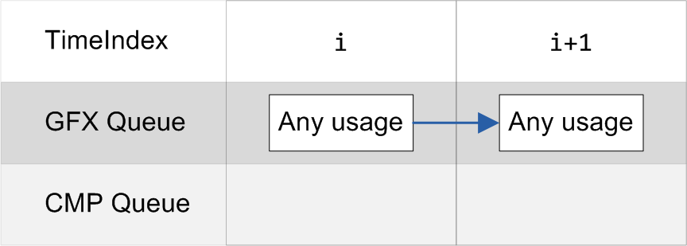
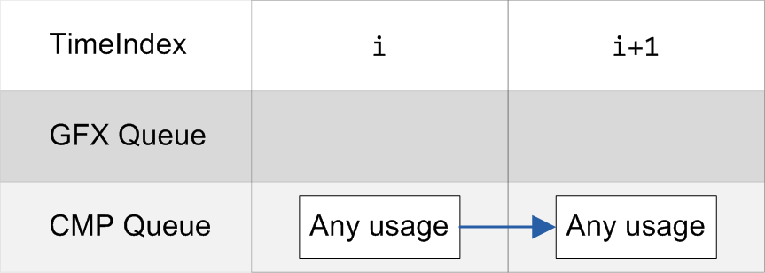
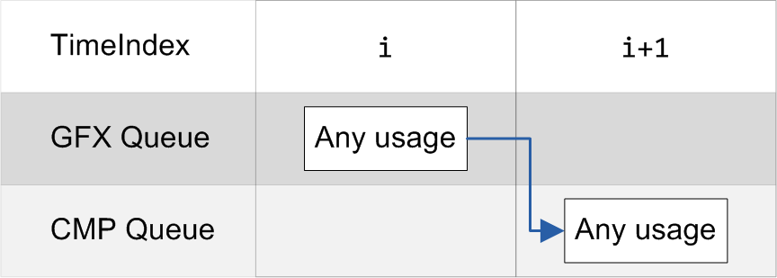
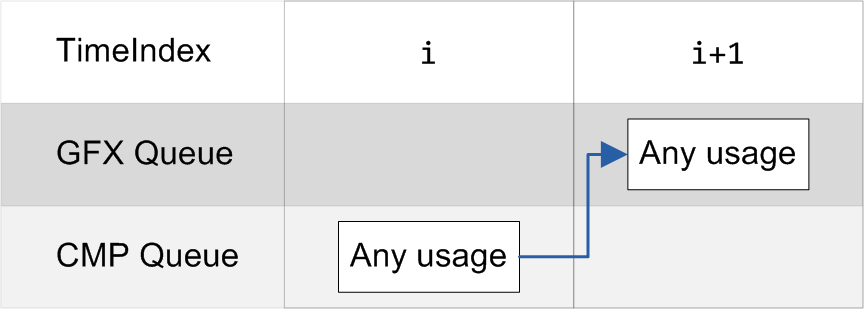
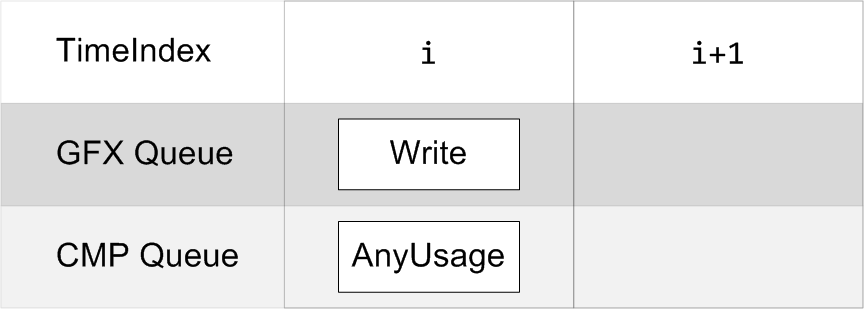
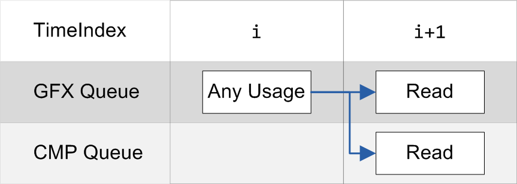
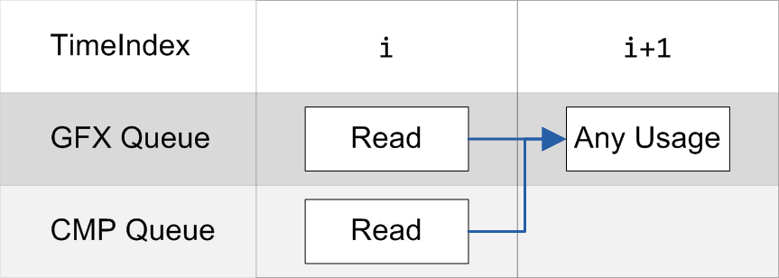
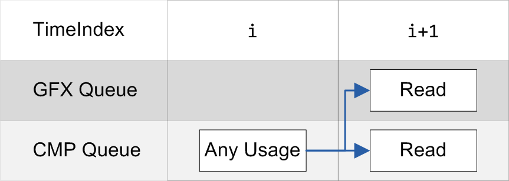
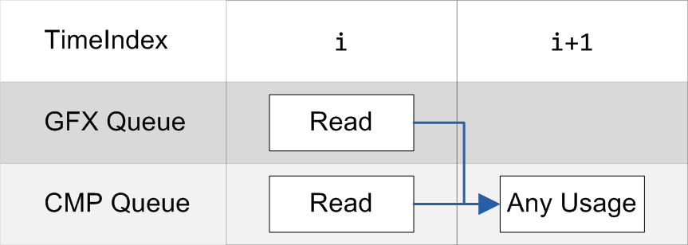
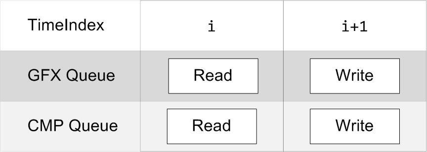

# Async compute

SGLib supports scheduling and simultanous execution of up to 3 command queues.

First of all, check that the physical device supports additional queues:

```cpp
// Check adapter if it supports features that you need
SG_ADAPTER_INFO_EXECUTION execInfo;
pAdapter->GetInfo(SG_ADAPTER_INFO_CAT_EXECUTION, &execInfo);

if (execInfo.ComputeQueues < 1)
	throw std::exception("Adapter doesn't support compute queues");
```

Configure the execution context for two queues:
```cpp
SG_EXECUTION_CONTEXT_DESC execCtxDesc;
execCtxDesc.FrameBuffers = 1; 
execCtxDesc.QueueCount = 2;                          // Declare two queues:
execCtxDesc.QueueTypes[0] = SG_QUEUE_TYPE_GRAPHICS;  // #0 is graphics (aka direct queue in D3D12)
execCtxDesc.QueueTypes[1] = SG_QUEUE_TYPE_COMPUTE;   // #1 is compute
```
Use queue slot indexes to schedule command lists on the corresponding slots:
```cpp
pExecCtx->BeginFrame();

ISGCommandList *pGfxCmdList = SG_NULL, *pCmpCmdList = SG_NULL;
pExecCtx->ScheduleCommandList(0, 1, &pGfxCmdList);  // Commands on #0 (graphics) queue at timeindex 1
pExecCtx->ScheduleCommandList(1, 1, &pCmpCmdList);  // Commands on #1 (compute) queue at timeindex 1

// Here you have two command lists that will be executed simultaneously on separate queues

pExecCtx->FinishCommandList(pGfxCmdList);
pExecCtx->FinishCommandList(pCmpCmdList);

pExecCtx->EndFrame();
```
## Restrictions
All restrictions of the asynchronous execution are mainly related to resource access order.
As it was noticed above, the binding of resources leads to switch their states.
The main restriction is incapatibility of read and write states.
Thus, the render must avoid using one subresource for writing and reading simultaneously (See [Async compute sample](../Samples/AsyncCompute/Readme.md)).
In addition, SGLib tracks a history for every resource that was used in a frame and resolves its transitions when the frame ends.\
The following table shows the most common resource transition patterns in multiqueue setups, their brief description, and validity in SGLib:

<table>

<tr>
<td><center><b>Description</b></center></td>
<td><center><b>Is allowed</b></center></td>
<td><center><b>Scheme</b></center></td>
</tr>

<tr>

<td style="max-width: 320px">
Switching from one state to another or between queues without conqurent cases
</td>

<td style="max-width: 100px"><b>YES</b></td>

<td>
<br>
<br>
<br>

</td>

</tr>

<tr>

<td style="max-width: 320px">
Simultaneous access to a subresource for writing and for reading or writing on the separated queues is not allowed.
</td>

<td style="max-width: 100px"><b>NO</b></td>

<td>

</td>

</tr>

<tr>

<td style="max-width: 320px">
The most common cases of asynchronous execution. When subresource are transfering between a one queue usage and a multiple queues usage.
</td>

<td style="max-width: 100px"><b>YES</b></td>

<td>
<br>

</td>

</tr>

<tr>

<td style="max-width: 320px">
A special cases of "ascending" and "descending" transfers, if a resource is accessed on a less capable queue than the most capable one of previous set or vice versa.<br>
This case leads to search for a capable queue for resolving that might make to significant overhead.<br>
Try to avoid this case.
</td>

<td style="max-width: 100px"><b>YES, but not recommended</b></td>

<td>
<br>

</td>

</tr>

<tr>

<td style="max-width: 320px">
A case when a subresource is used on multiple queues and needs to switch state for using on multiple queues on the next timeIndex.
</td>

<td style="max-width: 100px"><b>NO</b></td>

<td>

</td>

</tr>


</table>