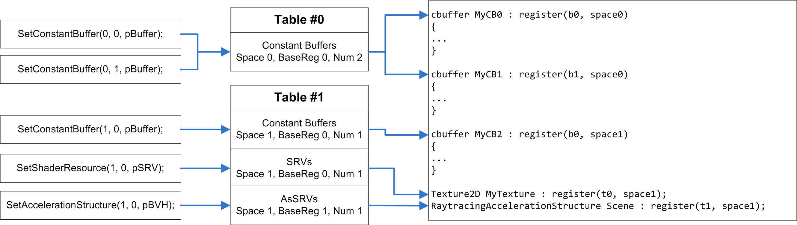

# Resource binding

Selecting resources (binding) for access in shaders and other stages of the graphics pipeline occurs through the binding context, which is part of the ```ISGCommandList``` object.

Binding resources is carried out in several ways, depending on their use. Basically, accessing resource data requires their representation using special objects - views. The exceptions are constant buffers, vertex and index buffers, and acceleration structures, which are connected directly.

Render targets and depth stencil views are bound to the output merger stage:
```cpp
void ISGCommandList::SetRenderTarget(
    SgU32 rtIndex, 
    ISGRenderTargetView* pView
);

void ISGCommandList::SetDepthStencil(
    ISGDepthStencilView* pView
);
```

Vertex and index buffers are bound to the input assembly stage by follow methods:
```cpp
void SetVertexBuffer(
    U32 slot,
    IBuffer* pVertexBuffer,
    U32 offset,
    U32 stride);

void SetIndexBuffer(
    IBuffer* pIndexBuffer,
    U32 offset,
    SG_FORMAT format);
```

Binding resources for access in shaders is carried out using the functions of the ```ISGCommandList``` object:
```cpp
void SetConstantBuffer(
    SgU32 paramIdx, 
    SgU32 bindPoint, 
    ISGResource* pBuffer
);

void SetShaderResource(
    SgU32 paramIdx, 
    SgU32 bindPoint, 
    ISGShaderResourceView* pView
);

void SetUnorderedAccessView(
    SgU32 paramIdx, 
    SgU32 bindPoint, 
    ISGUnorderedAccessView * pView
);

void SetAccelerationStructure(
    SgU32 paramIdx, 
    SgU32 bindPoint, 
    ISGTopLevelAS* pTLAS
);

void SetSampler(
    SgU32 paramIdx, 
    SgU32 bindPoint, 
    ISGSampler* pState
);
```

The binding performs using virtual indices of bind points and are remapped according to the description of the root signature. The paramIdx argument is the index of the root signature parameter, and bindPoint refers to a binding point in the list in the parameter (see [Root signature](#root-signature)).

> APIs **SetConstantBuffer** and **SetShaderResource** switch subresources that are refered by passed views to the reading state.
> APIs **SetUnorderedAccessView** and **SetAccelerationStructure** switch subresources that are refered by passed views to the reading and writing state.

## Resource views

There are 4 types of resource views:
* Shader resource view
* Unordered access view
* Render target view
* Depth stencil view

### Shader resource view
Shader resource views (SRVs) provide a layout of resources for reading in shaders.

SRVs can represent both buffers and textures if they are created with bind flags **SG_BUFFER_BIND_FLAG_SHADER_RESOURCE** and **SG_TEXTURE_BIND_FLAG_SHADER_RESOURCE** respectively.

SGLib divides buffer SRVs into layout types: structured, typed or byte addressed (requires additional flag **SG_BUFFER_BIND_FLAG_BYTE_ADDRESS**),
and texture SRVs into a simple texture and a cube texture (requires additional flag **SG_TEXTURE_BIND_FLAG_TEXTURE_CUBE**).

Follow code illustrates how to describe and create a SRV of first 128 elements of buffer by 16 bytes:
```cpp
SG_SHADER_RESOURCE_VIEW_DESC viewDesc;
viewDesc.Type = SG_SRV_TYPE_STRUCTURED_BUFFER;  // Define view as a structured buffer
viewDesc.StructuredBuffer.FirstElement   = 0;   // Index of the first element to be accessed by the view.
viewDesc.StructuredBuffer.ElementCount   = 128; // Number of elements in the resource.
viewDesc.StructuredBuffer.Stride         = 16;  // Size of each element in the buffer structure in bytes

pDevice->CreateShaderResourceView(pBuffer, &viewDesc, &pStructuredSRV);
```

As textures may be divided into several subresources, needs to config a set of them for representation.
Follow code illustrates how to describe a SRV that represents 4 mip levels of texture:
```cpp
SG_SHADER_RESOURCE_VIEW_DESC viewDesc;
viewDesc.Type                    = SG_SRV_TYPE_TEXTURE;         // Define view as a simple texture
viewDesc.Texture.Format          = SG_FORMAT_R8G8B8A8_UNORM;    // Format must be capatible with the texture base format
viewDesc.Texture.MostDetailedMip = 0;
viewDesc.Texture.MipLevels       = 4;
viewDesc.Texture.FirstArraySlice = 0;
viewDesc.Texture.ArraySize       = 1;
viewDesc.Texture.PlaneSlice      = 0;

pDevice->CreateShaderResourceView(pTexture, &viewDesc, &pTextureSRV);
```

### Unordered access view
Unordered access views (UAVs) provide a layout of resources for reading and writing in shaders.

UAVs can represent both buffers and textures if they are created with bind flags **SG_BUFFER_BIND_FLAG_UNORDERED_ACCESS** and **SG_TEXTURE_BIND_FLAG_UNORDERED_ACCESS** respectively.

SGLib divides buffer UAVs into layout types: structured, typed or byte addressed (requires additional flag **SG_BUFFER_BIND_FLAG_BYTE_ADDRESS**),
and texture UAVs.\
Follow code illustrates how to describe and create a UAV of first 128 elements of buffer by 16 bytes:
```cpp
SG_UNORDERED_ACCESS_VIEW_DESC viewDesc;
viewDesc.Type = SG_UAV_TYPE_STRUCTURED_BUFFER;  // Define view as a structured buffer
viewDesc.StructuredBuffer.FirstElement   = 0;   // Index of the first element to be accessed by the view.
viewDesc.StructuredBuffer.ElementCount   = 128; // Number of elements in the resource.
viewDesc.StructuredBuffer.Stride         = 16;  // Size of each element in the buffer structure in bytes

pDevice->CreateUnorderedAccessView(pBuffer, &viewDesc, &pStructuredUAV);
```

As textures may be divided into several subresources, needs to config a set of them for representation. 
Follow code illustrates how to describe a SRV that represents 5 array slices of texture:
```cpp
SG_UNORDERED_ACCESS_VIEW_DESC viewDesc;
viewDesc.Type = SG_UAV_TYPE_TEXTURE;                           // Define view as a texture
viewDesc.Texture.Format          = SG_FORMAT_R8G8B8A8_UNORM;   // Format must be capatible with the texture base format
viewDesc.Texture.MipSlice        = 0;                          // UAVs support an access to an only one MIP level
viewDesc.Texture.FirstArraySlice = 0;
viewDesc.Texture.ArraySize       = 5;
viewDesc.Texture.PlaneSlice      = 0;

pDevice->CreateUnorderedAccessView(pTexture, &viewDesc, &pTextureUAV);
```

### Render target view
Render target views (RTVs) provide a layout of textures for writing on the output merger stage.\
RTVs allow to access texture array with only one MIP level:
```cpp
SG_RENDER_TARGET_VIEW_DESC viewDesc;
viewDesc.Format          = SG_FORMAT_R8G8B8A8_UNORM;    // Format must be capatible with the texture base format
viewDesc.MipSlice        = 0;
viewDesc.FirstArraySlice = 0;
viewDesc.ArraySize       = 2;
viewDesc.PlaneSlice      = 0;

pDevice->CreateRenderTargetView(pTexture, &viewDesc, &pTextureRTV);
```

### Depth stencil view
Depth stencil views (DSVs) provide a layout of textures for reading and writing on the output merger stage.\
DSVs allow to access texture array with only one MIP level:
```cpp
SG_DEPTH_STENCIL_VIEW_DESC dsvDesc{};
dsvDesc.Format          = SG_FORMAT_D32_FLOAT;  // Format must be capatible with the texture base format
dsvDesc.MipSlice        = 0;
dsvDesc.FirstArraySlice = 0;
dsvDesc.ArraySize       = 1;

pDevice->CreateDepthStencilView(pTexture, &viewDesc, &pTextureDSV);
```

## Root signature

Root signatures describe mapping of shader shaders' bind points. At the moment, there is only one type of root signature is **SG_ROOT_SIGNATURE_TYPE_TABULAR**:
```cpp
typedef struct SG_ROOT_SIGNATURE_DESC
{
    SG_ROOT_SIGNATURE_TYPE Type;
    union
    {
        SG_TABULAR_ROOT_SIGNATURE Tabular;
    };
} SG_ROOT_SIGNATURE_DESC;
```
Tabular root signature allows remap bind point set of all shader stages.
It provides up to 7 tables that describe binding ranges for every resource types, samplers and a set of static samplers.
```cpp
typedef struct SG_BINDING_RANGE
{
    SgU32 RegisterSpace;
    SgU32 BaseShaderRegister;
    SgU32 NumRegisters;
} SG_BINDING_RANGE;

typedef struct SG_BINDING_TABLE_DESC
{
    SG_SHADER_VISIBILITY ShaderVisibility;
    SG_BINDING_RANGE ConstantBuffers;
    SG_BINDING_RANGE SRVs;
    SG_BINDING_RANGE UAVs;
    SG_BINDING_RANGE AsSRVs;

    SG_BINDING_RANGE Samplers;
    SgU32 NumStaticSamplers;
    SG_STATIC_SAMPLER_DESC* pStaticSamplers;
} SG_BINDING_TABLE_DESC;

typedef struct SG_TABULAR_ROOT_SIGNATURE
{
    SgU32 NumTables;
    SG_BINDING_TABLE_DESC* pTables;
} SG_TABULAR_ROOT_SIGNATURE;
```

Every table can be associated to one of raster stages or to all (even compute) at once:
```cpp
// Configure 2 binding tables for the vertex and pixel stages
SG_BINDING_TABLE_DESC tables[2] = {};
{
    // The 1st table is visible for vertex shader only
    tables[0].ShaderVisibility = SG_SHADER_VISIBILITY_VERTEX;
    tables[0].ConstantBuffers = { 0, 0, 1 };    // one constant buffer at the register #0 of space #0

    // The 2nd table is visible for pixel shader only
    tables[1].ShaderVisibility = SG_SHADER_VISIBILITY_PIXEL;
    tables[1].SRVs = { 0, 0, 1 };               // one shader resource at the register #0 of space #0
    tables[1].Samplers = { 0, 0, 1 };           // one sampler at the register #0 of space #0
}
```
```cpp
// Configure binding tables for compute pipeline state
SG_BINDING_TABLE_DESC table = {};
{
    // Use common access option for non-raster stages
    table.ShaderVisibility = SG_SHADER_VISIBILITY_ALL;
    table.ConstantBuffers = { 0, 0, 1 };        // one constant buffer at the register #0 of space #0
    table.SRVs = { 0, 0, 1 };                   // one shader resource at the register #0 of space #0
    table.UAVs = { 0, 0, 1 };                   // one unordered access view at the register #0 of space #0
}
```
The following image illustrates remapping sample using two binding tables:



> Pay attention that acceleration structures views is SRVs, they must not overlap with regular SRVs.
