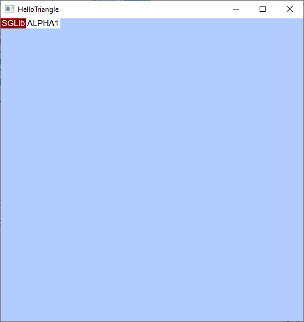
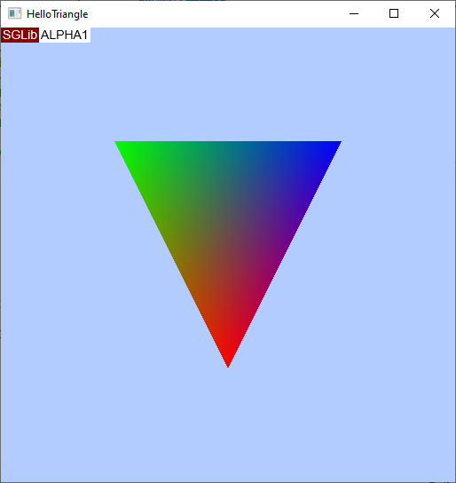

# HelloTriangle tutorial

This tutorial intended to the gantle introduction to SGLib programming. Here you get know how to init and destroy SGLib context, get adapter, create device and swap chain and render a simple geometry using vertex and pixel shaders.
It is recommended to create a project from scratch by following the instructions below, referring to the [Hello Triangle](../Samples/HelloTriangle/Readme.md) sample.

## Contents
1. [First of all](#first-of-all)
2. [Initializing](#initializing-sglib-session)
3. [Enumerate adapters](#enumerate-adapters)
4. [Create device](#create-device)
5. [Swap chain](#swap-chain)
6. [Pipeline state](#pipeline-state)
7. [Rendering](#rendering)

## First of all
Create a new empty CPP project and a file **Main.cpp**. Set-up your project so that the working debug directory is the same as output one. It's needed for load compiled shaders.

To continue, your application should display its window. The samples prefer to maintain console and window both, to have an easy way to print debug messages.\
Define and implement ```main()``` and ```CreateForm()``` functions:
```cpp
#include <Windows.h>

#define SCREEN_WIDTH 512
#define SCREEN_HEIGHT 512

HWND hWnd = NULL;

void CreateForm(HWND* pHwnd, int width, int height);

int main()
{
    CreateForm(&hWnd, SCREEN_WIDTH, SCREEN_HEIGHT);
    ShowWindow(hWnd, 1);

    MSG msg = { };
    while (GetMessage(&msg, NULL, 0, 0) > 0)
    {
        TranslateMessage(&msg);
        DispatchMessage(&msg);
    }

    return 0;
}

LRESULT CALLBACK WndProc(HWND hwnd, UINT msg, WPARAM wParam, LPARAM lParam)
{
    switch (msg)
    {
    case WM_DESTROY:
        PostQuitMessage(0);
        break;
    }

    return DefWindowProc(hwnd, msg, wParam, lParam);
}

void CreateForm(HWND* pHwnd, int width, int height)
{
    // Register the window class.
    HINSTANCE hInstance = GetModuleHandle(NULL);

    WNDCLASS wc = { };
    wc.lpfnWndProc = WndProc;
    wc.hInstance = hInstance;
    wc.lpszClassName = L"SGSample";
    RegisterClass(&wc);

    RECT windowRect = { 0, 0, width, height };
    AdjustWindowRect(&windowRect, WS_OVERLAPPEDWINDOW, FALSE);

    *pHwnd = CreateWindow(
        // Style & class
        wc.lpszClassName,       // Window class
        L"HelloTriangle",       // Window text
        WS_OVERLAPPEDWINDOW,    // Window style

        // Size and position
        CW_USEDEFAULT,
        CW_USEDEFAULT,
        windowRect.right - windowRect.left,
        windowRect.bottom - windowRect.top,

        // Additions
        NULL, NULL, hInstance, NULL
    );
}
```

## Initializing SGLib session

The next step is including SGLib headers and linking library, starting and stopping SGLib session:

```cpp
#include <Include/SGLib.h>

#ifdef _DEBUG
#pragma comment(lib, "../../Lib/SGLib_D3D12_dev.lib")
#else
#pragma comment(lib, "../../Lib/SGLib_D3D12.lib")
#endif

...
int main()
{
    if (SGLibInitialize(SG_NULL) != SG_OK)
        throw std::exception("SG initializing failed");

    CreateForm(&hWnd, SCREEN_WIDTH, SCREEN_HEIGHT);
    ...

    SGLibDestroy();
    return 0;
}
```

> Pay attention debug build uses __\*dev__ version of SGLib, that provides more detailed debug log and handles more errors. It's a good practice to use __\*dev__ version on the development stage.

## Enumerate adapters

Add new function that will enumerate available adapters and select the one to use for rendering. To enumerate adapters use ```SgEnumAdapters``` function, receiving the index of adapter in the system adapters array it returns one of two result codes: ```SG_ERROR_NOT_FOUND``` that means out of the array bounds and ```SG_OK``` means that adapter is available and returned to the second argument of function.

```cpp
void GetAdapter(ISGAdapter** ppAdapter)
{
    ISGAdapter* pAdapter = SG_NULL;

    int index = 0;
    while (SgEnumAdapters(index, &pAdapter) != SG_ERROR_NOT_FOUND)
    {
        index++;

        if (pAdapter == SG_NULL) // Unsupported adapter
            continue;

        // Check adapter if it supports features that you need
        SG_ADAPTER_INFO_EXECUTION execInfo;
        pAdapter->GetInfo(SG_ADAPTER_INFO_CAT_EXECUTION, &execInfo);

        // Adapter must support at least one graphics queue
        if (execInfo.GraphicsQueues <= 1)
            continue;

        *ppAdapter = pAdapter;
        return;
    }

    throw std::exception("Failed to get adapter");
}
```
Add a global pointer of ISGAdapter and call of the new function. And don't forget to release the adapter object before SGLib session ends.
```cpp
ISGAdapter* pAdapter = SG_NULL;
...

int main()
{
    ...
    GetAdapter(&pAdapter);
    ...
    pAdapter->Release();
    ...
}
```

## Create device

Add new function that will create device object based on chosen adapter using ```SgCreateDevice``` function.

```cpp
void CreateDevice(ISGAdapter* pAdapter, ISGDevice** ppDevice, ISGExecutionContext** ppContext)
{
    // Configure execution context:
    //   - Request 1 graphics queue and 2 frame buffer
    //   - One frame buffer means you can't schedule a new frame while the previous one is being processed
    SG_EXECUTION_CONTEXT_DESC execCtxDesc;
    execCtxDesc.FrameBuffers = 2;
    execCtxDesc.QueueCount = 1;
    execCtxDesc.QueueTypes[0] = SG_QUEUE_TYPE_GRAPHICS;

    // Configure device 
    SG_DEVICE_DESC deviceDesc;
    deviceDesc.pDeviceRemovalCallback = SG_NULL;
    deviceDesc.pMemoryDebugConfig = SG_NULL;
    deviceDesc.pExecutionContextDesc = &execCtxDesc;

    if (SgCreateDevice(pAdapter, &deviceDesc, ppDevice) != SG_OK)
        throw std::exception("Failed to create device object");

    ISGExecutionContext* pExecutionContext = SG_NULL;
    if ((*ppDevice)->GetExecutionContext(ppContext) != SG_OK)
        throw std::exception("Failed to get execution context");
}
```

As well as for ```GetAdapter``` add global pointers to ISGDevice and ISGExecutionContext objects and the call of this function in the main function. Don't forget to release those objects before releasing the adapter:

```cpp
    pExecutionContext->Release();
    pDevice->Release();
```

## Swap chain

Implement a new funciton that will create swap chain to bring result of render on the screen:

```cpp
void CreateSwapChain(ISGExecutionContext* pContext, HWND hWnd, ISGSwapChain** ppSwapChain)
{
    SG_SWAP_CHAIN_DESC swapChainDesc;
    swapChainDesc.OutputWindow = hWnd;                      // Pass window handle
    swapChainDesc.Width = 0;                                // Leave back buffers' size 0
    swapChainDesc.Height = 0;                               // to adjust them to client rect
    swapChainDesc.Format = SG_FORMAT_R8G8B8A8_UNORM;
    swapChainDesc.BufferCount = 2;                          // There should be at least 2 buffer
    swapChainDesc.Flags = SG_SWAP_CHAIN_FLAG_ALLOW_TEARING;
    swapChainDesc.SwapEffect = SG_SWAP_EFFECT_SEQUENTIAL;

    // Set the execution context and an index of the queue slot to perform the swap chain on it
    // Look at execution context description, we required a graphics queue in slot #0
    if (SgCreateSwapChain(pContext, 0, &swapChainDesc, ppSwapChain) != SG_OK)
        throw std::exception("Failed to create swap chain");
}
```

Now your application is ready to bring the first image. Let's check it.
Add new function with the follow code:
```cpp
void RenderFrame()
{
    pExecutionContext->BeginFrame();

    ISGCommandList* pCommandList = SG_NULL;

    // Schedule command list on #0-queue (graphics) at TimeIndex #1 - the first available time index
    pExecutionContext->ScheduleCommandList(0, 1, &pCommandList);

    // Clear the current swap chain buffer and set it as render target
    SG_COLOR_4F clearColor = { 0.7f , 0.8f, 1.0f, 1.0f };
    pCommandList->ClearRenderTarget(pSwapChain->GetCurrentRTV(), &clearColor);

    // Finish and apply recorded command list
    pExecutionContext->FinishCommandList(pCommandList);

    // Submit frame and involved swap chains (which need to be presented)
    // If there's no swap chains to present, just use EndFrame()
    pExecutionContext->EndFrame1(1, &pSwapChain);
}
```

Add handling of the WM_PAINT message with a call of this function:
```cpp
LRESULT CALLBACK WndProc(HWND hwnd, UINT msg, WPARAM wParam, LPARAM lParam)
{
...
    case WM_PAINT:
        RenderFrame();
        return 0;
...
}
```

And the last step is adding ```pExecutionContext->WaitForIdle();``` call before releasing SG objects.
> Applications must always call ```WaitForIdle()``` when the render session is over to sync GPU and CPU works.
Let's recheck the main function, it should looks like:
```cpp
int main()
{
    if (SGLibInitialize(SG_NULL) != SG_OK)
        throw std::exception("SG initializing failed");

    CreateForm(&hWnd, SCREEN_WIDTH, SCREEN_HEIGHT);

    GetAdapter(&pAdapter);
    CreateDevice(pAdapter, &pDevice, &pExecutionContext);
    CreateSwapChain(pExecutionContext, hWnd, &pSwapChain);

    ShowWindow(hWnd, 1);

    MSG msg = { };
    while (GetMessage(&msg, NULL, 0, 0) > 0)
    {
        TranslateMessage(&msg);
        DispatchMessage(&msg);
    }

    // Wait all submitted frames
    pExecutionContext->WaitForIdle();

    // And destroy everything
    pSwapChain->Release();
    pExecutionContext->Release();
    pDevice->Release();
    pAdapter->Release();

    SGLibDestroy();
    return 0;
}
```

The application window should be filled with light blue color.



## Pipeline state

The next step is create pipeline state object that allows us to render simple geometry using vertex and pixel shaders.
First of all, create two sources for vertex and pixel shaders and set-up them properties to compile for the shader model 5.0.

Listing of the vertex shader:
```c
struct Vertex
{
    float3 Pos : POSITION0;
    float3 Color : COLOR0;
};

struct PS_DATA
{
    float4 Pos : SV_POSITION;
    float3 Color : COLOR0;
};

PS_DATA main(Vertex input)
{
    PS_DATA output = (PS_DATA) 0;
    output.Pos = float4(input.Pos, 1.0f);
    output.Color = input.Color;

    return output;
}
```

Listing of the pixel shader:
```c
struct PS_DATA
{
    float4 Pos : SV_POSITION;
    float3 Color : COLOR0;
};

float4 main(PS_DATA dat) : SV_TARGET
{
    return float4(dat.Color, 1.0f);
}
```

Build your project to compile shaders. After that you should have **VertexShader.cso** and **PixelShader.cso** files in your output directory.

Pay attention to the ```Vertex``` struct, it's a structure of each vertex of the input geometry. Declare the similar struct on the CPP side, it will descript the format of the vertex buffer item:
```cpp
struct Vertex
{
    float x, y, z;
    float r, g, b;
};
```

Create a new function ```void CreatePipelineState(ISGDevice* pDevice, ISGPipelineState** ppPipelineState);```.
Now we need to bind the structure of vertex buffer item to the vertex shader input. Add the follow code into the new functino:
```cpp
SG_INPUT_ELEMENT_DESC inputElements[]
{
        
    { "POSITION", 0, SG_FORMAT_R32G32B32A32_FLOAT, 0, offsetof(Vertex, x), SG_INPUT_CLASSIFICATION_PER_VERTEX_DATA, 0},
    { "COLOR", 0, SG_FORMAT_R32G32B32_FLOAT, 0, offsetof(Vertex, r), SG_INPUT_CLASSIFICATION_PER_VERTEX_DATA, 0}
};

ISGInputLayout* pInputLayout = SG_NULL;
if (pDevice->CreateInputLayout(_countof(inputElements), inputElements, &pInputLayout) != SG_OK)
    throw std::exception("Failed to create input layout");
```

> Pay attention that we are not binding to the structure member, but to its semantics, binding to it the offset of the Vertex CPP structure member.

The next step is to load compiled shaders include ```fstream``` header and add the follow lamda to the ```CreatePipelineState``` function:
```cpp
auto LoadBinary = [](char const* pFilename, std::vector<uint8_t>& outBuffer)
    {
        std::ifstream file(pFilename, std::ios::binary | std::ios::ate);

        if (!file.is_open())
            return false;

        std::streamsize size = file.tellg();
        file.seekg(0, std::ios::beg);

        outBuffer.resize(size);

        if (file.read((char*)outBuffer.data(), size))
        {
            return true;
        }

        return false;
    };
```
Add add a code to load the shaders:
```cpp
std::vector<uint8_t> vsBufer;
if (!LoadBinary("VertexShader.cso", vsBufer))
    throw std::exception("Failed to load vertex shader");

std::vector<uint8_t> psBufer;
if (!LoadBinary("PixelShader.cso", psBufer))
    throw std::exception("Failed to load pixel shader");
```

> ```std::vector``` was used to simplify memory allocations.

Now create graphics pipeline state that uses the loaded vertex and pixel shaders:
```cpp
SG_GRAPHICS_PIPELINE_STATE_DESC psoDesc{};
psoDesc.pInputLayout = pInputLayout;
psoDesc.VS = { vsBufer.data(), vsBufer.size() };
psoDesc.PS = { psBufer.data(), psBufer.size() };

// As there's no any to bind, init an empty root signature
psoDesc.RootSignature.Type = SG_ROOT_SIGNATURE_TYPE_TABULAR;
psoDesc.RootSignature.Tabular.NumTables = 0;
psoDesc.RootSignature.Tabular.pTables = SG_NULL;

if (pDevice->CreateGraphicsPipelineState(&psoDesc, ppPipelineState) != SG_OK)
    throw std::exception("Failed to create pipeline state");

// No need to keep input layout any more
pInputLayout->Release();
```
Pay attention that we are not going to bind any resources, so we just describe an empty root signature.

## Rendering

It's time to create vertex buffer:

```cpp
void InitVertexBuffer(ISGDevice* pDevice, ISGBuffer** ppVertexBuffer)
{
    // Init vertex array (first three floats is vertex position, second three is color
    Vertex vertices[3]
    {
        { 0.0f, -0.5f, 0.0f, 1.0f, 0.0f, 0.0f, },
        { -0.5f, 0.5f, 0.0f, 0.0f, 1.0f, 0.0f, },
        { 0.5f, 0.5f, 0.0f, 0.0f, 0.0f, 1.0f, },
    };

    // Create upload buffer to fill it on CPU side
    SG_BUFFER_DESC vbDesc = {};
    vbDesc.Type = SG_BUFFER_TYPE_UPLOAD;
    vbDesc.BindFlags |= SG_BUFFER_BIND_FLAG_VERTEX_BUFFER;
    vbDesc.Size = sizeof(vertices);

    ISGBuffer* pVertexBuffer = SG_NULL;
    if (pDevice->CreateBuffer(&vbDesc, &pVertexBuffer) != SG_OK)
        throw std::exception("Failed to create vertex buffer");

    void* pVBData = nullptr;
    if (pVertexBuffer->Map(&pVBData) != SG_OK)
        throw std::exception("Failed to map vertex buffer data");

    memcpy(pVBData, vertices, sizeof(vertices));
    pVertexBuffer->Unmap();

    *ppVertexBuffer = pVertexBuffer;
}
```

Edit ```RenderFrame``` function to make it looks like the follow code:
```cpp
void RenderFrame()
{
    pExecutionContext->BeginFrame();

    ISGCommandList* pCommandList = SG_NULL;

    // Schedule command list on #0-queue (graphics) at TimeIndex #1 - the first available time index
    pExecutionContext->ScheduleCommandList(0, 1, &pCommandList);

    // Clear the current swap chain buffer and set it as render target
    SG_COLOR_4F clearColor = { 0.7f , 0.8f, 1.0f, 1.0f };
    pCommandList->ClearRenderTarget(pSwapChain->GetCurrentRTV(), &clearColor);
    pCommandList->SetRenderTarget(0, pSwapChain->GetCurrentRTV());

    // Set-up frame parameters (viewport and scissor rect)
    SG_VIEWPORT viewport{ 0.0f, 0.0f, SCREEN_WIDTH, SCREEN_HEIGHT, 0.0f , 1.0f };
    pCommandList->SetViewports(1, &viewport);

    SG_RECT scissor{ 0, 0, SCREEN_WIDTH, SCREEN_HEIGHT };
    pCommandList->SetScissorRects(1, &scissor);

    // Set-up pipeline state, primitive topology and vertex buffer
    pCommandList->SetPipelineState(pPipelineState);
    pCommandList->SetPrimitiveTopology(SG_PRIMITIVE_TOPOLOGY_TRIANGLE_LIST);
    pCommandList->SetVertexBuffer(0, pVertexBuffer, 0, sizeof(Vertex));

    pCommandList->DrawInstanced(3, 1, 0, 0);

    // Finish and apply recorded command list
    pExecutionContext->FinishCommandList(pCommandList);

    // Submit frame and involved swap chains (which need to be presented)
    // If there's no swap chains to present, just use EndFrame()
    pExecutionContext->EndFrame1(1, &pSwapChain);
}
```

Don't forget add calls to ```CreatePipelineState``` and ```InitVertexBuffer``` functions in the main function.\
After all, your application should display a multi-colored triangle:

