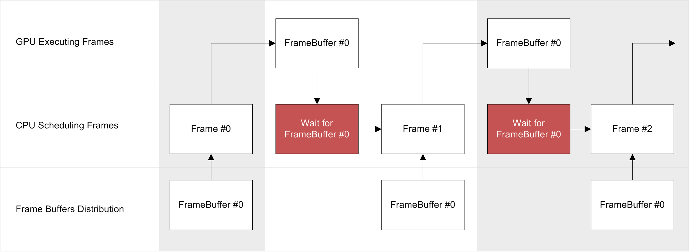
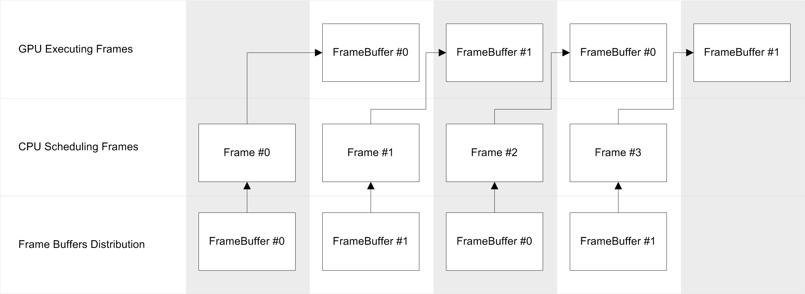
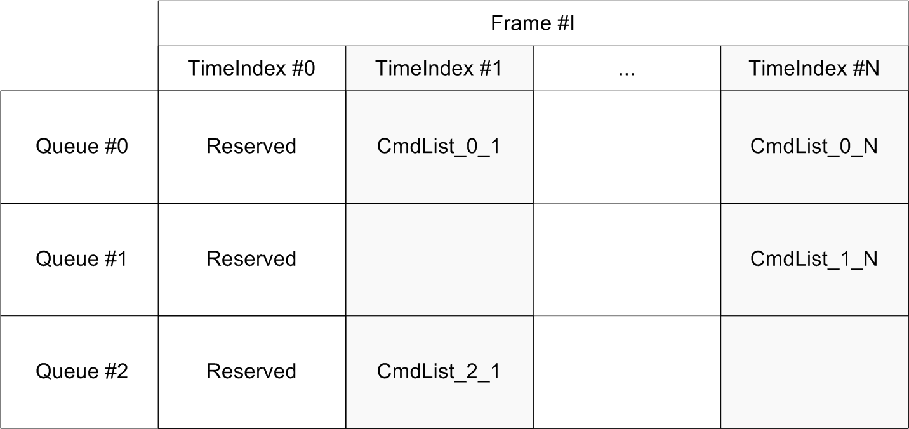

# Scheduling frames and commands

SGLib performs deferred execution of frames.
Every frame must be fully scheduled and applieed before it will be executed.
Frame is a sequence of command lists ordered by conditional 16-bit time indices.
The order of command list scheduling doesn't matter, сommand lists will be executed in the order of their time indexes (see [Command lists scheduling](#command-lists-scheduling)). 

## Frame buffers

Frame buffering reduces the latency of the previous frame by duplicating the frame's execution time resources.
Let's say application requests only one frame buffer when creates execution context and assume that the average execution time of one frame on the GPU is less or equal to the scheduling time of one frame.
```cpp
SG_EXECUTION_CONTEXT_DESC execCtxDesc;
execCtxDesc.FrameBuffers = 1; 
```

Consider a situation in which the size of the frame buffer pool is 1. Assuming that the average execution time of commands on the GPU is equal to or less than the frame scheduling time. Since the frame will not start executing until it is scheduled, and the only resource buffer is locked until the frame is executed. Another call to ```ISGExecutionContext::BeginFrame()``` will block the scheduler thread at least until it receives a signal that the commands have finished executing on GP (see picture).

<p align="center">

</p>

As a result, when using a pool of one frame buffer, the time to work with one frame on the CPU will be at least the total scheduling time and the frame execution time on the GPU.\
Now consider the situation using a pool of two frame buffers. The execution time on the GPU side is also equal to or less than the frame scheduling time. In this case, while the frame is being scheduled on the CPU side, the GPU executes commands from the previous frame.
When scheduling is completed and the frame is sent for execution, the previous GPU works will already be done and the associated frame buffer will be freed.
Thus, the call to ```ISGExecutionContext::BeginFrame()``` will potentially take place without any delays (see figure).

<p align="center">

</p>

## Command lists scheduling

Frame scheduling consists of distributing command lists across GPU queues and execution order.
The frame execution time is divided into conditional time intervals, marked with the **TimeIndex**.
**TimeIndex** is a 16-bit unsigned integer value in the range **[1; 65520]**. Time index **0** and indexes after **65520** are reserved for internal use.

When scheduling the commands at the time index **i**, SGLib guarantees that its execution will not start before the command list at the time index **i-1**, but is guaranteed to start before the execution of the of command list at the time index **i+1**. An example of the distribution of command lists across time indexes and queues is illustrated in the figure below.

<p align="center">

</p>

> Scheduling two or more command lists in the same time index in the same queue leads to unpredictable behavior. At the moment SGLib has no any protection against this.

> Call ```ISGExecutionContext::ScheduleCommandList``` returns ISGCommandList with ref counter equal **1**. It should be also equal **1** when you release it by ```ISGExecutionContext::FinishCommandList```. ```ISGExecutionContext::ScheduleCommandList``` doesn't create a new command list, it just get it from the pool of the current frame buffer.

## Sample

```cpp
// First of all, get execution context
ISGExecutionContext* pExecCtx = SG_NULL;
pDevice->GetExecutionContext(&pExecCtx);

...

// BeginFrame waits for execution of a previous frame 
pExecCtx->BeginFrame();

ISGCommandList* pCmdList = SG_NULL;

// Schedule a command list on #0 queue at timeindex 1
if (pExecCtx->ScheduleCommandList(0, 1, &pCmdList) == SG_OK)
{
    ...

    // That's it, now release command list, it should have refcounter equal 1
    // Otherwise SGLib throw an error
    pExecCtx->FinishCommandList(pCmdList);
}

// Now end the frame, apply for execution and swap a back buffer of the chain
pExecCtx->EndFrame1(1, &pSwapChain);

...

// When application is finishing, wait every scheduled jobs before releasing everything and don't forget to release execution context:
pExecCtx->WaitForIdle();
pExecCtx->Release();
```