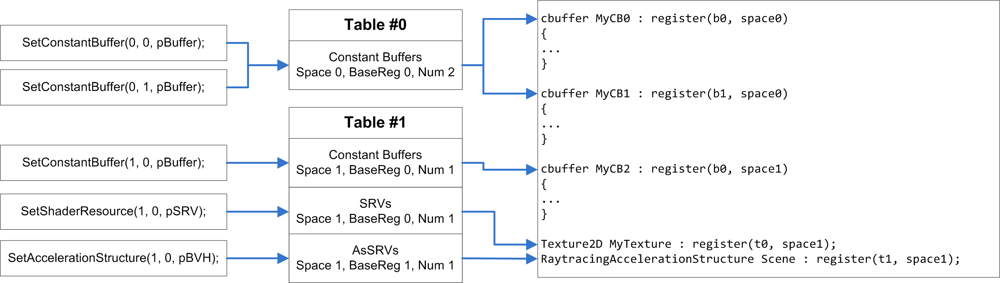
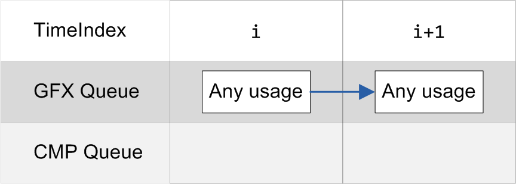
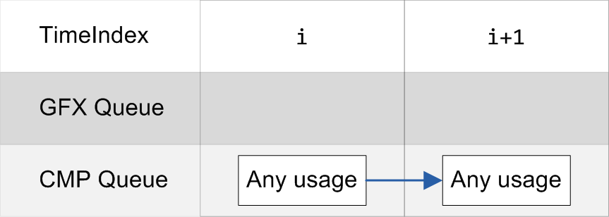
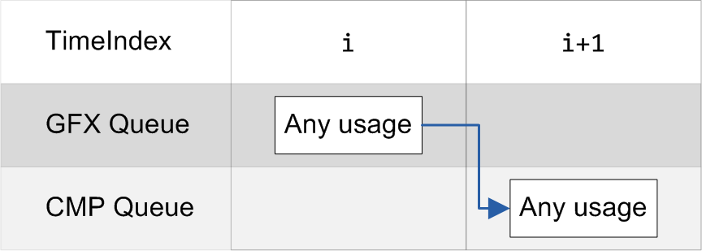
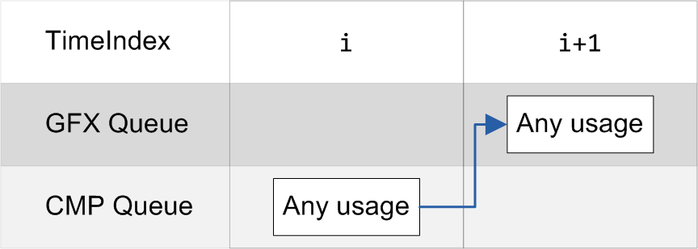
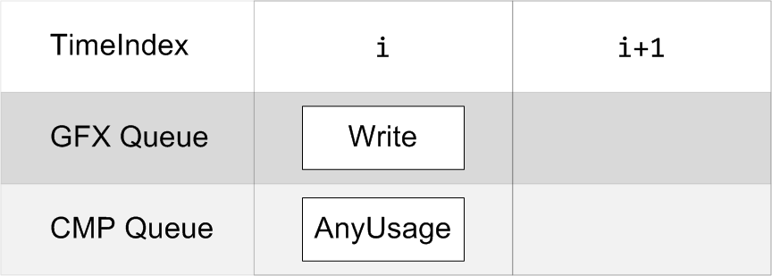
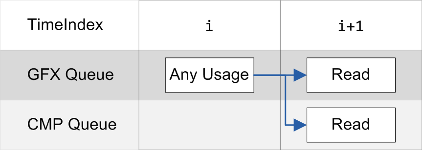
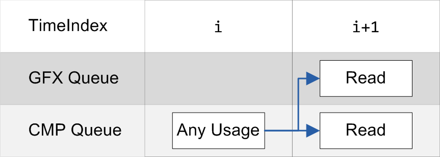
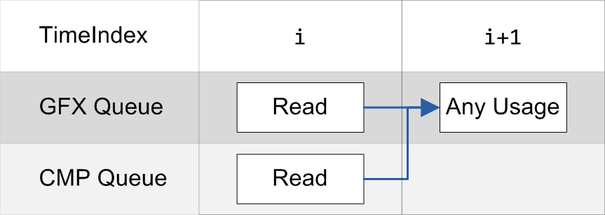
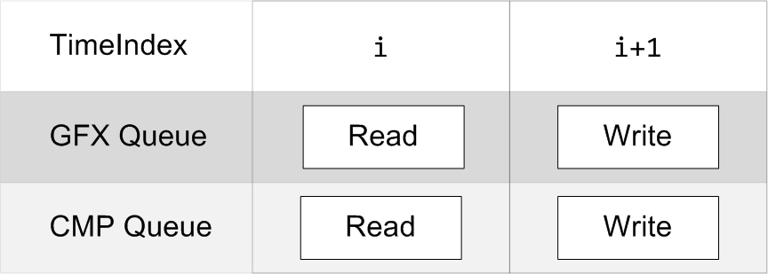

# SGLib Tutorial
This section is in progress.

## From the author
Writing documentation in a not native language turned out to be harder than expected.\
SGLib is very similar to known graphics APIs, especially DirectX. So, if you have some experience with rendering, learning SGLib shouldn't be a problem for you at all.\
Here I tried to tell about features and capabilities by code samples instead of boring and clumsy narrations.
It should help for getting started.

I'm sorry for my English and I hope a clumsy narration won't be a significant obstacle to learning SGLib. :)\
It will be better very soon.

## Contents
1. [Enumerate adapters](#1-enumerate-adapters)
2. [Device](#2-device)
3. [Swap chain](#3-swap-chain)
4. [Schedule frames](#4-schedule-frames)
5. [Resources](#5-resources)
6. [Pipeline states](#6-pipeline-states)
7. [View](#7-views)
8. [Async compute](#8-async-compute)
9. [Debugging and development tips](#9-debugging-and-development-tips)

## 1. Enumerate adapters
SGLib has a global state like an adapter list, debug layers and system environment. It should be initialized by ```SGLibInitialize``` in the beginning and destroyed by ```SGLibDestroy``` when your graphics session is completelly finished.

Optionally, ```SGLibInitialize``` receives a pointer to ```SG_DEBUG_CONFIG``` struct to config debug layers and tools.

```cpp 
if (SGLibInitialize(SG_NULL) != SG_OK)
{
    throw std::exception("SG initializing failed");
}
```

Before creating device object, application chooses an adapter that will be represented by device object. The sample bellow shows an approach to enumerate all available adapters and showing its name and total memory amount:

```cpp 
int index = 0;

ISGAdapter* pAdapter = SG_NULL;
while (SgEnumAdapters(index, &pAdapter) != SG_ERROR_NOT_FOUND)
{
    std::cout << index << ". ";
    index++;

    if (pAdapter == SG_NULL)
    {
        std::cout << "Unsupported adapter" << std::endl;
        continue;
    }

    // Here you get info about adapter like memory amount, supported features etc.
    SG_ADAPTER_INFO_COMMON commonInfo;
    pAdapter->GetInfo(SG_ADAPTER_INFO_CAT_COMMON, &commonInfo);

    SG_ADAPTER_INFO_MEMORY memoryInfo;
    pAdapter->GetInfo(SG_ADAPTER_INFO_CAT_MEMORY, &memoryInfo);

    uint64_t memMB = memoryInfo.LocalMemory >> 20;
    std::cout << commonInfo.Description << " (" << memMB << "MB)" << std::endl;

    // SgEnumAdapters increments adapter's ref counter, if it won't be used, need to release
    pAdapter->Release();
}
```

When the application is finishing, destroy the SGLib singleton:
```cpp 
SGLibDestroy();
```

## 2. Device
As adapter is choosen, it's time to create device object:

```cpp 
// Check adapter if it supports features that you need
SG_ADAPTER_INFO_EXECUTION execInfo;
pAdapter->GetInfo(SG_ADAPTER_INFO_CAT_EXECUTION, &execInfo);

if (execInfo.GraphicsQueues < 1)
	throw std::exception("Adapter doesn't support graphics queues");

// Configure execution context:
//   - Request one graphics queue and one frame buffer
//   - One frame buffer means you can't schedule a new frame while the previous one is being processed
SG_EXECUTION_CONTEXT_DESC execCtxDesc;
execCtxDesc.FrameBuffers = 1; 
execCtxDesc.QueueCount = 1;
execCtxDesc.QueueTypes[0] = SG_QUEUE_TYPE_GRAPHICS;

// Configure device 
SG_DEVICE_DESC deviceDesc;
deviceDesc.pDeviceRemovalCallback = SG_NULL;
deviceDesc.pMemoryDebugConfig = SG_NULL;
deviceDesc.pExecutionContextDesc = &execCtxDesc;

ISGDevice* pDevice = SG_NULL;
if (SgCreateDeviceObject(pAdapter, &deviceDesc, &pDevice) != SG_OK)
    throw std::exception("Failed to create device object");

// Device object increments the adapter's ref counter,
// Don't forget to release it on your side
pAdapter->Release();
pAdapter = SG_NULL;
```
When the graphics session is done don't forget to release device before destroying SGLib signleton
```cpp
pDevice->Release();
```
## 3. Swap chain
Create swap chain to bring result of render on the screen:
```cpp
SG_SWAP_CHAIN_DESC swapChainDesc;
swapChainDesc.OutputWindow = hWnd;                      // Pass window handle
swapChainDesc.Width = 0;                                // Leave back buffers' size 0
swapChainDesc.Height = 0;                               // to adjust them to client rect
swapChainDesc.Format = SG_FORMAT_R8G8B8A8_UNORM;
swapChainDesc.BufferCount = 2;                          // There should be at least 2 buffer
swapChainDesc.Flags = SG_SWAP_CHAIN_FLAG_ALLOW_TEARING;
swapChainDesc.SwapEffect = SG_SWAP_EFFECT_SEQUENTIAL;

ISGSwapChain* pSwapChain = SG_NULL;

// Set the execution context and an index of the queue slot to perform the swap chain on it
// Look at execution context description, we required a graphics queue in slot #0
if (SgCreateSwapChain(m_pExecutionContext, 0, &swapChainDesc, &pSwapChain) != SG_OK)
    throw std::exception("Failed to create swap chain");
```

> Use ```pSwapChain->SetSyncInterval()``` to set a sync interval for all next presents until another.

### Fullscreen
Swap chains support two scenaries to toggle fullscreen using ```ISGSwapChain::SetFullScreenState```:
* Native - switching to fullscreen mode it switchs a video mode as well. To perform this scenario SG_SWAP_CHAIN_FLAG_ALLOW_MODE_SWITCH flag must be set upon creation. It is also recommended to use available output display modes to prevent your application from hanging in an unsupported mode.
* Borderless - more preferred and modern scenario where your application stretching to a fullscreen borderless window. This way you save a control over the application even in unexcpected cases.
> You don't need to change window size manually, it's DXGI responcibility.

### Resize chain buffers
Use ```ISGSwapChain::Resize``` to resize you swap chain buffers (e.g. on window resize event).

> Pay attention, ```ISGSwapChain::SetFullScreenState``` and ```ISGSwapChain::Resize``` APIs must not be called withing active frame (between ```ISGExecutionContext::BeginFrame``` and  ```ISGExecutionContext::End``` calls).


## 4. Schedule frames
SGLib performs deferred execution of frames.
Every frame must be fully scheduled and applieed before it will be executed.
Frame is a sequence of command lists ordered by conditional 16-bit time indices.
The order of command list scheduling doesn't matter, сommand lists will be executed in the order of their time indexes. 
> TimeIndex is a 16-bit unsigned integer value in the range [1; 65520]. Time index 0 and indexes after 65520 are reserved for internal use.

First of all, get execution context:
```cpp
ISGExecutionContext* pExecCtx = SG_NULL;
pDevice->GetExecutionContext(&pExecCtx);
```
Follow code describes a single frame of the graphics session:
```cpp
// BeginFrame waits for execution of a previous frame 
pExecCtx->BeginFrame();

ISGCommandList* pCmdList = SG_NULL;

// Schedule a command list on #0 queue at timeindex 1
if (pExecCtx->ScheduleCommandList(0, 1, &pCmdList) == SG_OK)
{
    // Get render target view of the current buffer in the chain
    ISGRenderTargetView* pRTV = pSwapChain->GetCurrentRTV();

    // And clear it into skyColor
    SG_COLOR_4F skyColor = { 0.8f, 0.9f, 1.0f, 1 };
    pCmdList->ClearRenderTarget(pRTV, &skyColor);

    // That's it, now release command list, it should have refcounter equal 1
    // Otherwise SGLib throw an error
    pExecCtx->FinishCommandList(pCmdList);
}

// Now end the frame, apply for execution and swap a back buffer of the chain
pExecCtx->EndFrame1(1, &pSwapChain);
```

When application is finishing, wait every scheduled jobs before releasing everything and don't forget to release execution context:
```cpp
pExecCtx->WaitForIdle();
pExecCtx->Release();
```

## 5. Resources
### Buffers
SGLib divides buffers by 3 types:
* **SG_BUFFER_TYPE_COMMON** - buffer placed in the video memory, allows fast reading and writing on GPU side, supports any bind flags (**SG_BUFFER_BIND_FLAGS**);
* **SG_BUFFER_TYPE_UPLOAD** - buffer placed in the shared memory, allows reading on GPU side and writing on CPU, doesn't support unordered access binding (**SG_BUFFER_BIND_FLAG_UNORDERED_ACCESS**)
* **SG_BUFFER_TYPE_READBACK** - buffer placed in the shared memory, allows writing on GPU side and reading on CPU, doesn't support any bindings;

Mostly, buffers defined as **SG_BUFFER_TYPE_UPLOAD** are used as constant buffers or for uploading data to high-performance common buffers.
Buffers defined as **SG_BUFFER_TYPE_READBACK** are used for transfering data from GPU to CPU.

Follow code creates a buffer that can be bound for unordered acccess in shader:
```cpp
SG_BUFFER_DESC desc;
desc.Type = SG_BUFFER_TYPE_COMMON;
desc.BindFlags = SG_BUFFER_BIND_FLAG_UNORDERED_ACCESS;
desc.Size = 256;

ISGBuffer* pBuffer = SG_NULL;
if (pDevice->CreateBuffer(&desc, &pBuffer) != SG_OK)
    throw std::exception("Failed to create buffer");
```

### Textures
SGLib divides textures by 4 types:
* **SG_TEXTURE_TYPE_COMMON** - textures placed in the video memory, allows fast reading and writing on GPU side, supports any bind flags (**SG_TEXTURE_BIND_FLAGS**);
* **SG_TEXTURE_TYPE_DEPTH_STENCIL** - textures placed in the video memory and optimized for storing depth data, supports binding as shader resource (**SG_TEXTURE_BIND_FLAG_SHADER_RESOURCE** and **SG_TEXTURE_BIND_FLAG_TEXTURE_CUBE**)
* **SG_TEXTURE_TYPE_UPLOAD** - textures placed in the shared memory, allows reading on GPU side and writing on CPU, doesn't support any bindings;
* **SG_TEXTURE_TYPE_READBACK** - textures placed in the shared memory, allows writing on GPU side and reading on CPU, doesn't support any bindings;

Textures that defined as **SG_TEXTURE_TYPE_UPLOAD** or **SG_TEXTURE_TYPE_READBACK** used only for transfering data between CPU and GPU.

> Textures defined as **SG_TEXTURE_TYPE_UPLOAD** or **SG_TEXTURE_TYPE_READBACK** although contain footprints that corespond to the texture description, but are buffers. Due this, such textures can't be represented for shader access, **BindFlags** must be equal **SG_TEXTURE_BIND_FLAG_NONE**.

Follow code creates a texture that can be bound as shader resource:
```cpp
SG_TEXTURE_DESC desc;
desc.Type = SG_TEXTURE_TYPE_COMMON;
desc.BindFlags = SG_TEXTURE_BIND_FLAG_SHADER_RESOURCE;

desc.Dimension = SG_TEXTURE_DIMENSION_2D;
desc.Format = SG_FORMAT_R8G8B8A8_UNORM;
desc.Width = 128;
desc.Height = 128;
desc.DepthOrArraySize = 1;
desc.MipLevels = 1;

desc.SampleCount = 0;   // If you don't need MSAA, just set 0 or 1
desc.SampleQuality = 0; // If you don't need MSAA, just set 0

// If it is not a render target or depth stencil, default value doesn't matter
desc.DefaultValue.Format = SG_FORMAT_UNKNOWN;
desc.DefaultValue.Color = {};

ISGTexture* pTexture = SG_NULL;
if (pDevice->CreateTexture(&desc, &pTexture) != SG_OK)
    throw std::exception("Failed to create texture");
```
> **SG_TEXTURE_DESC::DefaultValue** specifies a default clearing values for render targets or depth stencil buffers to perform optimized clearing by **ISGCommandList::ClearRenderTargetDefault** and **ISGCommandList::ClearDepthStencilDefault** 

### Subresources
SGLib divides resources into subresources. Buffers always consist of only one subresource and **ISGBuffer** has a direct API to access buffer data:
```cpp
void* pData = nullptr;

// Mapping works only for upload or readback resources
if (pUploadBuffer->Map(&pData) != SG_OK)
    throw std::exception("Failed to map buffer");

// Here you have an access to buffer data using pData

pUploadBuffer->Unmap();
```

Textures may be divided into several subresources (by MIP levels, array slices or plane slices for certain formats). See [DirectX 12 subreosurces](https://learn.microsoft.com/en-us/windows/win32/direct3d12/subresources) for more details.\
Thus to perform an access to textures data use **ISGTexture::GetSubresource** at first:
```cpp
ISGSubresource* pSubresource = nullptr;

// Request a subresource at (mip, array slice, plane slice)
if (pTexture->GetSubresource(0, 0, 0, &pSubresource) == SG_OK)
{
    SG_MAPPED_SUBRESOURCE mappedSubresource;

    // Mapping works only for upload or readback resources
    if (pSubresource->Map(&mappedSubresource) == SG_OK)
    {
        // Here you have an access to texture data using mappedSubresource.pData

        // After all don't forget unmap subresource
        pSubresource->Unmap();
    }

    // And release it
    pSubresource->Release();
}
```

It also works if you need to copy texture by subresources:
```cpp
ISGSubresource* pDstSubres = nullptr;
ISGSubresource* pSrcSubres = nullptr;

// Let's copy slice #1 to slice #0
if (pTexture->GetSubresource(0, 0, 0, &pDstSubres) != SG_OK)
    throw std::exception("Failed to get dest subresource");

if (pTexture->GetSubresource(0, 1, 0, &pSrcSubres) != SG_OK)
    throw std::exception("Failed to get src subresource");

pCommandList->CopySubresource(pDstSubres, pSrcSubres);

pDstSubres->Release();
pSrcSubres->Release();
```

## 6. Pipeline states
Pipeline states represent a set of shaders, input layout and root signature.
There is 4 types of pipeline states: graphics, mesh, compute and ray tracing.

### Graphics pipeline state
Describes regular graphics pipeline state containing vertex, pixel, geometry, hull and domain shader stages:
```cpp
typedef struct SG_GRAPHICS_PIPELINE_STATE_DESC
{
    SG_ROOT_SIGNATURE_DESC RootSignature;
    SG_SHADER_BYTECODE PS;
    SG_SHADER_BYTECODE VS;
    SG_SHADER_BYTECODE DS;
    SG_SHADER_BYTECODE HS;
    SG_SHADER_BYTECODE GS;
    ISGInputLayout*  pInputLayout;
} SG_GRAPHICS_PIPELINE_STATE_DESC;
```
* Members with type **SG_SHADER_BYTECODE** store shader bytecode in the format DXBC.

### Mesh pipeline state
Describes raster pipeline state based on mesh shaders:
```cpp
typedef struct SG_MESH_PIPELINE_STATE_DESC
{
    SG_ROOT_SIGNATURE_DESC RootSignature;
    SG_SHADER_BYTECODE PS;
    SG_SHADER_BYTECODE MS;
    SG_SHADER_BYTECODE AS;
} SG_MESH_PIPELINE_STATE_DESC;
```
* Members with type **SG_SHADER_BYTECODE** store shader bytecode in the format DXBC.

Before creating mesh pipeline states, check adapter on supporting the feature:
```cpp
SG_ADAPTER_INFO_EXECUTION execInfo;
pAdapter->GetInfo(SG_ADAPTER_INFO_CAT_EXECUTION, &execInfo);

if (execInfo.MeshShaderTier == SG_MESH_SHADER_TIER_NOT_SUPPORTED)
    throw std::exception("Adapter doesn't support mesh shading");
```

### Compute pipeline state
Describes compute pipeline state:
```cpp
typedef struct SG_COMPUTE_PIPELINE_STATE_DESC
{
    SG_ROOT_SIGNATURE_DESC RootSignature;
    SG_SHADER_BYTECODE CS;
} SG_COMPUTE_PIPELINE_STATE_DESC;
```
* Members with type **SG_SHADER_BYTECODE** store shader bytecode in the format DXBC.

### Ray tracing pipeline state
WIP
 > Ray tracing pipeline states are not described in this section so far (refer to [Ray tracing sample](../Samples/Raytracing/Readme.md) for more details).

### Root signature
Root signatures describe mapping of shader shaders' bind points. At the moment, there is only one type of root signature is **SG_ROOT_SIGNATURE_TYPE_TABULAR**:
```cpp
typedef struct SG_ROOT_SIGNATURE_DESC
{
    SG_ROOT_SIGNATURE_TYPE Type;
    union
    {
        SG_TABULAR_ROOT_SIGNATURE Tabular;
    };
} SG_ROOT_SIGNATURE_DESC;
```
Tabular root signature allows remap bind point set of all shader stages.
It provides up to 7 tables that describe binding ranges for every resource types, samplers and a set of static samplers.
```cpp
typedef struct SG_BINDING_RANGE
{
    SgU32 RegisterSpace;
    SgU32 BaseShaderRegister;
    SgU32 NumRegisters;
} SG_BINDING_RANGE;

typedef struct SG_BINDING_TABLE_DESC
{
    SG_SHADER_VISIBILITY ShaderVisibility;
    SG_BINDING_RANGE ConstantBuffers;
    SG_BINDING_RANGE SRVs;
    SG_BINDING_RANGE UAVs;
    SG_BINDING_RANGE AsSRVs;

    SG_BINDING_RANGE Samplers;
    SgU32 NumStaticSamplers;
    SG_STATIC_SAMPLER_DESC* pStaticSamplers;
} SG_BINDING_TABLE_DESC;

typedef struct SG_TABULAR_ROOT_SIGNATURE
{
    SgU32 NumTables;
    SG_BINDING_TABLE_DESC* pTables;
} SG_TABULAR_ROOT_SIGNATURE;
```

Every table can be associated to one of raster stages or to all (even compute) at once:
```cpp
// Configure 2 binding tables for the vertex and pixel stages
SG_BINDING_TABLE_DESC tables[2] = {};
{
    // The 1st table is visible for vertex shader only
    tables[0].ShaderVisibility = SG_SHADER_VISIBILITY_VERTEX;
    tables[0].ConstantBuffers = { 0, 0, 1 };    // one constant buffer at the register #0 of space #0

    // The 2nd table is visible for pixel shader only
    tables[1].ShaderVisibility = SG_SHADER_VISIBILITY_PIXEL;
    tables[1].SRVs = { 0, 0, 1 };               // one shader resource at the register #0 of space #0
    tables[1].Samplers = { 0, 0, 1 };           // one sampler at the register #0 of space #0
}
```
```cpp
// Configure binding tables for compute pipeline state
SG_BINDING_TABLE_DESC table = {};
{
    // Use common access option for non-raster stages
    table.ShaderVisibility = SG_SHADER_VISIBILITY_ALL;
    table.ConstantBuffers = { 0, 0, 1 };        // one constant buffer at the register #0 of space #0
    table.SRVs = { 0, 0, 1 };                   // one shader resource at the register #0 of space #0
    table.UAVs = { 0, 0, 1 };                   // one unordered access view at the register #0 of space #0
}
```
The following image illustrates remapping sample using two binding tables:



> Pay attention that acceleration structures views is SRVs, they must not overlap with regular SRVs.


## 7. Views

SGLib support 4 types of resource views:
* Shader resource view
* Unordered access view
* Render target view
* Depth stencil view

### Shader resource view
Shader resource views (SRVs) provide a layout of resources for reading in shaders.

SRVs can represent both buffers and textures if they are created with bind flags **SG_BUFFER_BIND_FLAG_SHADER_RESOURCE** and **SG_TEXTURE_BIND_FLAG_SHADER_RESOURCE** respectively.

SGLib divides buffer SRVs into layout types: structured, typed or byte addressed (requires additional flag **SG_BUFFER_BIND_FLAG_BYTE_ADDRESS**),
and texture SRVs into a simple texture and a cube texture (requires additional flag **SG_TEXTURE_BIND_FLAG_TEXTURE_CUBE**).

Follow code illustrates how to describe and create a SRV of first 128 elements of buffer by 16 bytes:
```cpp
SG_SHADER_RESOURCE_VIEW_DESC viewDesc;
viewDesc.Type = SG_SRV_TYPE_STRUCTURED_BUFFER;  // Define view as a structured buffer
viewDesc.StructuredBuffer.FirstElement   = 0;   // Index of the first element to be accessed by the view.
viewDesc.StructuredBuffer.ElementCount   = 128; // Number of elements in the resource.
viewDesc.StructuredBuffer.Stride         = 16;  // Size of each element in the buffer structure in bytes

pDevice->CreateShaderResourceView(pBuffer, &viewDesc, &pStructuredSRV);
```

As textures may be divided into several subresources, needs to config a set of them for representation.
Follow code illustrates how to describe a SRV that represents 4 mip levels of texture:
```cpp
SG_SHADER_RESOURCE_VIEW_DESC viewDesc;
viewDesc.Type                    = SG_SRV_TYPE_TEXTURE;         // Define view as a simple texture
viewDesc.Texture.Format          = SG_FORMAT_R8G8B8A8_UNORM;    // Format must be capatible with the texture base format
viewDesc.Texture.MostDetailedMip = 0;
viewDesc.Texture.MipLevels       = 4;
viewDesc.Texture.FirstArraySlice = 0;
viewDesc.Texture.ArraySize       = 1;
viewDesc.Texture.PlaneSlice      = 0;

pDevice->CreateShaderResourceView(pTexture, &viewDesc, &pTextureSRV);
```

### Unordered access view
Unordered access views (UAVs) provide a layout of resources for reading and writing in shaders.

UAVs can represent both buffers and textures if they are created with bind flags **SG_BUFFER_BIND_FLAG_UNORDERED_ACCESS** and **SG_TEXTURE_BIND_FLAG_UNORDERED_ACCESS** respectively.

SGLib divides buffer UAVs into layout types: structured, typed or byte addressed (requires additional flag **SG_BUFFER_BIND_FLAG_BYTE_ADDRESS**),
and texture UAVs.\
Follow code illustrates how to describe and create a UAV of first 128 elements of buffer by 16 bytes:
```cpp
SG_UNORDERED_ACCESS_VIEW_DESC viewDesc;
viewDesc.Type = SG_UAV_TYPE_STRUCTURED_BUFFER;  // Define view as a structured buffer
viewDesc.StructuredBuffer.FirstElement   = 0;   // Index of the first element to be accessed by the view.
viewDesc.StructuredBuffer.ElementCount   = 128; // Number of elements in the resource.
viewDesc.StructuredBuffer.Stride         = 16;  // Size of each element in the buffer structure in bytes

pDevice->CreateUnorderedAccessView(pBuffer, &viewDesc, &pStructuredUAV);
```

As textures may be divided into several subresources, needs to config a set of them for representation. 
Follow code illustrates how to describe a SRV that represents 5 array slices of texture:
```cpp
SG_UNORDERED_ACCESS_VIEW_DESC viewDesc;
viewDesc.Type = SG_UAV_TYPE_TEXTURE;                           // Define view as a texture
viewDesc.Texture.Format          = SG_FORMAT_R8G8B8A8_UNORM;   // Format must be capatible with the texture base format
viewDesc.Texture.MipSlice        = 0;                          // UAVs support an access to an only one MIP level
viewDesc.Texture.FirstArraySlice = 0;
viewDesc.Texture.ArraySize       = 5;
viewDesc.Texture.PlaneSlice      = 0;

pDevice->CreateUnorderedAccessView(pTexture, &viewDesc, &pTextureUAV);
```

### Render target view
Render target views (RTVs) provide a layout of textures for writing on the output merger stage.\
RTVs allow to access texture array with only one MIP level:
```cpp
SG_RENDER_TARGET_VIEW_DESC viewDesc;
viewDesc.Format          = SG_FORMAT_R8G8B8A8_UNORM;    // Format must be capatible with the texture base format
viewDesc.MipSlice        = 0;
viewDesc.FirstArraySlice = 0;
viewDesc.ArraySize       = 2;
viewDesc.PlaneSlice      = 0;

pDevice->CreateRenderTargetView(pTexture, &viewDesc, &pTextureRTV);
```

### Depth stencil view
Depth stencil views (DSVs) provide a layout of textures for reading and writing on the output merger stage.\
DSVs allow to access texture array with only one MIP level:
```cpp
SG_DEPTH_STENCIL_VIEW_DESC dsvDesc{};
dsvDesc.Format          = SG_FORMAT_D32_FLOAT;  // Format must be capatible with the texture base format
dsvDesc.MipSlice        = 0;
dsvDesc.FirstArraySlice = 0;
dsvDesc.ArraySize       = 1;

pDevice->CreateDepthStencilView(pTexture, &viewDesc, &pTextureDSV);
```

### Binding resources
There's several ways to bind resources to the pipeline depending of their type of view. 
Render targets and depth stencil views are bound to the output merger stage:
```cpp
void SetRenderTarget(
    SgU32 rtIndex, 
    ISGRenderTargetView* pView
);

void SetDepthStencil(
    ISGDepthStencilView* pView
);
```
These APIs switch subresources that are refered by passed views to the writing state.
Other types of views, constant buffers and samplers may be passed through a root signature table to the specified shader stage:
```cpp
void SetConstantBuffer(
    SgU32 paramIdx, 
    SgU32 bindPoint, 
    ISGResource* pBuffer
);

void SetShaderResource(
    SgU32 paramIdx, 
    SgU32 bindPoint, 
    ISGShaderResourceView* pView
);

void SetUnorderedAccessView(
    SgU32 paramIdx, 
    SgU32 bindPoint, 
    ISGUnorderedAccessView * pView
);

void SetAccelerationStructure(
    SgU32 paramIdx, 
    SgU32 bindPoint, 
    ISGTopLevelAS* pTLAS
);

void SetSampler(
    SgU32 paramIdx, 
    SgU32 bindPoint, 
    ISGSampler* pState
);
```
APIs above receive parameter index as first argument, that refers to a table of a root signature, the second argument is a index of bind point in the range corresponding to the resource type in the table.
* APIs **SetConstantBuffer** and **SetShaderResource** switch subresources that are refered by passed views to the reading state.
* APIs **SetUnorderedAccessView** and **SetAccelerationStructure** switch subresources that are refered by passed views to the reading and writing state.

## 8. Async compute

To make the device execute commands simultanously, more than one queue must be allocated. Check that your physical device supports additional queues:

```cpp
// Check adapter if it supports features that you need
SG_ADAPTER_INFO_EXECUTION execInfo;
pAdapter->GetInfo(SG_ADAPTER_INFO_CAT_EXECUTION, &execInfo);

if (execInfo.ComputeQueues < 1)
	throw std::exception("Adapter doesn't support compute queues");
```

Configure the execution context for two queues:
```cpp
SG_EXECUTION_CONTEXT_DESC execCtxDesc;
execCtxDesc.FrameBuffers = 1; 
execCtxDesc.QueueCount = 2;                          // Declare two queues:
execCtxDesc.QueueTypes[0] = SG_QUEUE_TYPE_GRAPHICS;  // #0 is graphics (aka direct queue in D3D12)
execCtxDesc.QueueTypes[1] = SG_QUEUE_TYPE_COMPUTE;   // #1 is compute
```
Use queue slot indexes to schedule command lists on the corresponding slots:
```cpp
pExecCtx->BeginFrame();

ISGCommandList *pGfxCmdList = SG_NULL, *pCmpCmdList = SG_NULL;
pExecCtx->ScheduleCommandList(0, 1, &pGfxCmdList);  // Commands on #0 (graphics) queue at timeindex 1
pExecCtx->ScheduleCommandList(1, 1, &pCmpCmdList);  // Commands on #1 (compute) queue at timeindex 1

// Here you have two command lists that will be executed simultaneously on separate queues

pExecCtx->FinishCommandList(pGfxCmdList);
pExecCtx->FinishCommandList(pCmpCmdList);

pExecCtx->EndFrame();
```
### Restrictions
All restrictions of the asynchronous execution are mainly related to resource access order.
As it was noticed above, the binding of resources leads to switch their states.
The main restriction is incapatibility of read and write states.
Thus, the render must avoid using one subresource for writing and reading simultaneously (See [Async compute sample](../Samples/AsyncCompute/Readme.md)).
In addition, SGLib tracks a history for every resource that was used in a frame and resolves its transitions when the frame ends.\
The following table shows the most common resource transition patterns in multiqueue setups, their brief description, and validity in SGLib:

<table>

<tr>
<td><b>Description</b></td>
<td><b>Is allowed</b></td>
<td><b>Scheme</b></td>
</tr>

<tr>

<td style="max-width: 320px">
Switching from one state to another or between queues without conqurent cases
</td>

<td style="max-width: 100px"><b>YES</b></td>

<td>
<br>
<br>
<br>

</td>

</tr>

<tr>

<td style="max-width: 320px">
Simultaneous access to a subresource for writing and for reading or writing on the separated queues is not allowed.
</td>

<td style="max-width: 100px"><b>NO</b></td>

<td>

</td>

</tr>

<tr>

<td style="max-width: 320px">
The most common cases of asynchronous execution. When subresource are transfering between a one queue usage and a multiple queues usage.
</td>

<td style="max-width: 100px"><b>YES</b></td>

<td>
<br>
<br>

</td>

</tr>

<tr>

<td style="max-width: 320px">
A special case of "descending transfer", if a resource is accessed on a less capable queue than the most capable one of previous set.<br>
This case leads to search for a capable queue for resolving that might make to significant overhead.<br>
Try to avoid this case.
</td>

<td style="max-width: 100px"><b>YES, but not recommended</b></td>

<td>

</td>

</tr>

<tr>

<td style="max-width: 320px">
A case when a subresource is used on multiple queues and needs to switch state for using on multiple queues on the next timeIndex.
</td>

<td style="max-width: 100px"><b>NO</b></td>

<td>

</td>

</tr>


</table>

## 9. Debugging and development tips

It is good practice to develop an application based on **_dev** builds. These builds may be slower than release builds in certain cases, but can provide more debugging information and help avoid early bugs.

Use debug layers, especially if something returns **SG_ERROR_API**, it means that SGLib cannot handle an API error:
```cpp 
SG_DEBUG_CONFIG debugConfig{};
debugConfig.DebugLevel = SG_DEBUG_L1;

if (SGLibInitialize(&debugConfig) != SG_OK)
    throw std::exception("SG initializing failed");
```

