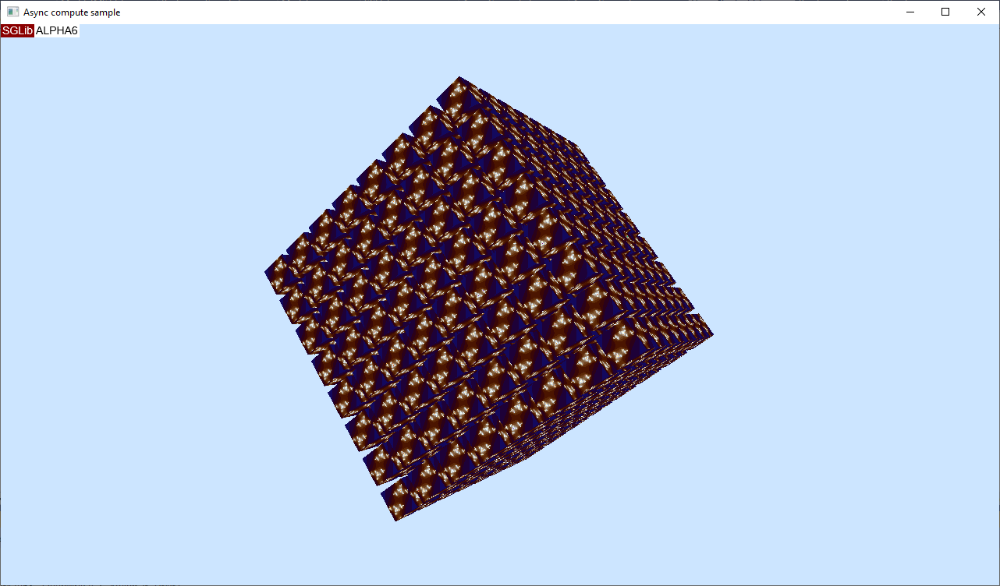
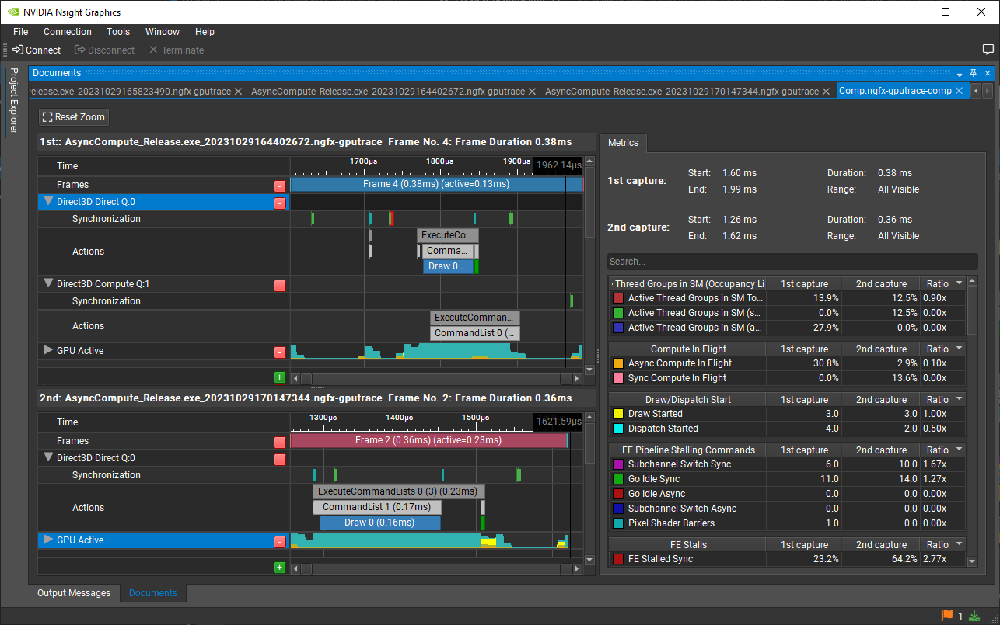

# Async compute sample

This sample demonstrates the asynchronous execution of commands to generate a texture and use it for rendering geometry.

The application creates device with two command queues.
Every frame it schedules two command lists, the first of those renders 512 boxes textured by an animated image that generated in the second one.

To prevent access conflicts the application use texture array of several slices: graphics pipeline uses a slice of the current frame and compute shader writes new data to slice for the next one.

#### Analisys
Analisys of the asyncronous execution can be provided by NVidia NSight Graphics.
The screenshot bellow show differences between frames with asyncronous execution and sequential one:

The scheduling asynchronous commands makes some overhead on the CPU side. On the other hand overlapping GPU workloads saves a significant amount of GPU time and as frame complexity and execution time increase, the performance gains will become much more significant and cover this overhead many times.
