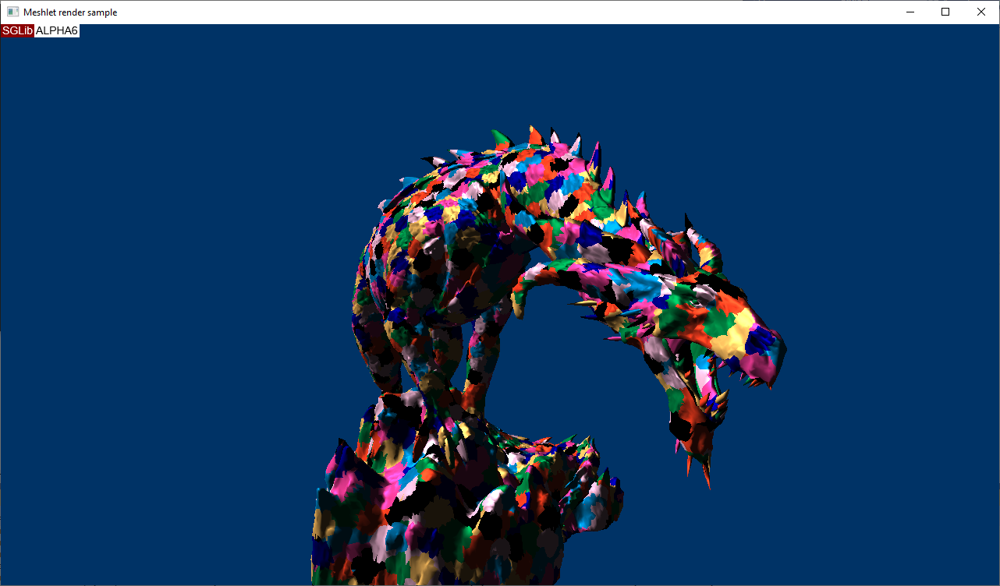

# Meshlet Render sample

This sample demonstrates how to render a meshletized model using SGLib. This application repeats a logic of Microsoft's MeshletRender that loads the binary model files exported by the Wavefront Converter command line tool.
