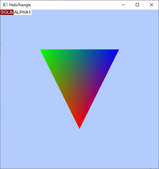
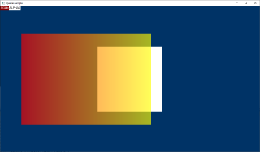
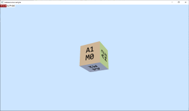
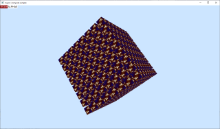
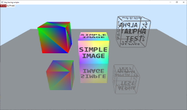
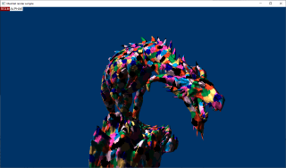

# SGLib Samples
This collection of samples act as an introduction to SGLib programming.

# Tutorial Samples
## 1. [HelloTriangle Sample](HelloTriangle/Readme.md)
This sample demonstrates the simplest way to render geometry using SGLib. It was created as a reference for [HelloTriangle tutorial](../../Docs/HelloTriangleTutorial.md).

## 2. [Queries Sample](Queries/Readme.md)
This sample demonstrates the use of binary occlusion queries and predication.

## 3. [Subresources Sample](Subresources/Readme.md)
This sample demonstrates uploading a texture array containing a few mip levels from a single image.

## 4. [AsyncCompute Sample](AsyncCompute/Readme.md)
This sample demonstrates scheduling command lists on different queues for an asynchronous execution. 

## 5. [Ray tracing Sample](Raytracing/Readme.md)
This sample demonstrates a simple animation of three boxes bouncing on a flat reflecting surface. It's rendered by ray tracing pipeline, without the rasterizator.

## 6. [Meshlet render Sample](MeshletRender/Readme.md)
This sample demonstrates how to render a meshletized model using SGLib.

