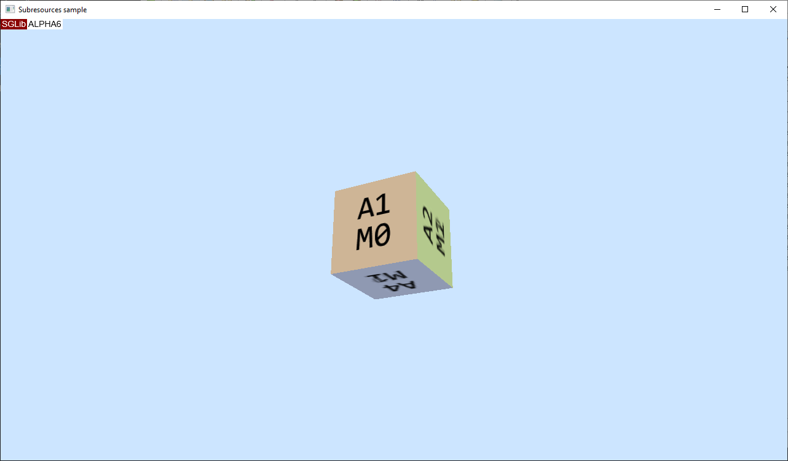

# Subresources sample

This sample demonstrates uploading a texture array containing a few mip levels from a single image. This approach are not the optimal way to storing data however it covers several cases of interaction with subresources:
* Creating and uploading an interediate texture from file;
* Getting subresources of texture by array slice and mip level;
* Copying parts of the intermediate texture to subresources of a main texture;
